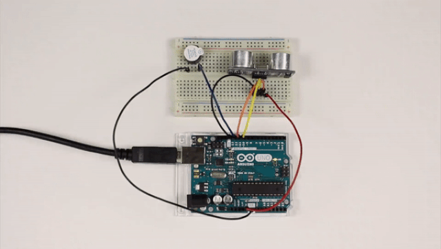
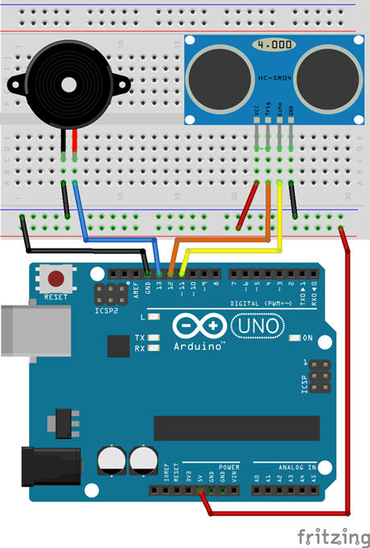
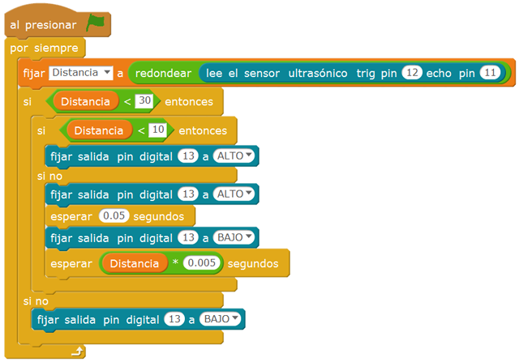

# Detector de aparcamiento con ultrasonidos

El objetivo de esta práctica es medir la distancia entre objetos simulando el detector de aparcamiento con zumbador existente en algunos vehículos. Para ello se va a utilizar un sensor de ultrasonidos.



## Materiales

- 1 Arduino UNO
- 1 Protoboard
- 6 Latiguillos
- 1 Ultrasonidos
- 1 Zumbador

## Esquema eléctrico

Teniendo en cuenta las características técnicas de los diodos led que utilizamos en esta práctica, calculamos la resistencia del circuito aplicando la Ley de Ohm.

| Sensor de proximidad HC-SR04  |           |
| ----------------------------- | --------- |
| Polarizado                    | Si        |
| Tensión                       | 5V        |
| Rango de medición             | 2cm a 4m  |

| Características Zumbador         |        |
| -------------------------------- | ------ |
| Polarizado                       | Sí     |
| Tensión de trabajo               | 3-12V  |

Fijándonos en los pines del sensor de ultrasonidos, se conecta el pin Vcc al pin 5V de la placa de arduino, el GND al GND de la placa de arduino, y los pines triger y echo a los pines 12 y 11 respectivamente. Por otro lado se conecta el zumbador al pin digital 13 de la placa de arduino.



## Programación en mBlock

Al ejecutar el código se deberá detectar la distancia mediante el bloque que devuelve la distancia en centímetros y almacenarla en una variable. De esta forma en caso de estar a más de 30 centímetros el zumbador permanecerá desactivado. En caso de estar a menos 10 centímetros se activará de forma fija, y si se encuentra entre 10 y 30 centímetros irá aumentando la velocidad del zumbador en base a una constante de 5 milisegundos.



## Programación en Arduino

En primer lugar, se configura el pin digitales 13 y 12 en modo salida (OUTPUT) y el pin digital 11 en modo entrada (INPUT). Esta configuración se establece en la función setup(), ya que solamente se ejecuta una vez. Además se establece el pin digital 12 a un valor bajo (LOW).

Al ejecutar el código se deberá detectar la distancia mediante el bloque que devuelve la distancia en centímetros y almacenarla en una variable. De esta forma en caso de estar a más de 30 centímetros el zumbador permanecerá desactivado. En caso de estar a menos 10 centímetros se activará de forma fija, y si se encuentra entre 10 y 30 centímetros irá aumentando la velocidad del zumbador en base a una constante de 5 milisegundos.

```
/**
 * Detector de aparcamiento
 */

void setup() {
    pinMode(13, OUTPUT);
    pinMode(12, OUTPUT);
    pinMode(11, INPUT);
    
    digitalWrite(13, LOW);
    digitalWrite(12, LOW);
}

void loop() {
    digitalWrite(12, HIGH);
    delayMicroseconds(10);
    digitalWrite(12, LOW);
    
    long tiempo;
    tiempo = pulseIn(11, HIGH);
    
    // Velocidad Sonido = 343 m/s
    float distancia = 34300*tiempo*0.000001;
    distancia = distancia / 2;
    
    if(int(distancia)<30){
    if(int(distancia)<10){
        digitalWrite(13, HIGH);
    }else{
        digitalWrite(13, HIGH);
        delay(50);
        digitalWrite(13, LOW);
        delay(distancia*5);
    }
    }else{
        digitalWrite(13, LOW);
    }
}
```
