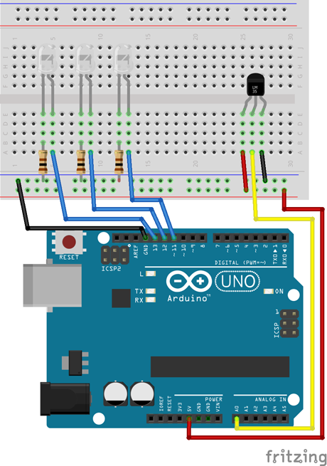
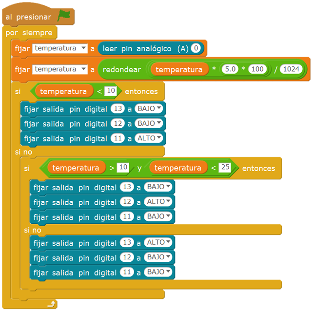

# Sensor de temperatura

El objetivo de esta práctica es encender los LEDs rojo, naranja o azul dependiendo de la temperatura ambiente, siendo el color azul inferior a 10 grados y el color rojo más de 25 grados.


## Materiales

- 1 Arduino UNO
- 1 Protoboard
- 7 Latiguillos
- 3 LEDs (rojo, naranja, azul)
- 1 Sensor de temperatura LM35
- 3 Resistencia de 220Ω (rojo-rojo-marrón)

## Esquema eléctrico

| Sensor de temperatura LM35    |               |
| ----------------------------- | ------------- |
| Polarizado                    | Si            |
| Señal de salida               | Analógica     |
| Tensión                       | 3V a 5V       |
| Rango de medición             | -55° a 150°C  |
| Precisión                     | ±0,5°C        |

El sensor de temperatura se conectará a los terminales de 5V y GND siendo la patilla central el valor analógico que medirá la temperatura. Los extremos son para alimentación, mientras que el pin central proporciona la medición en una referencia de tensión, a razón de 10mV/ºC.

El rango de medición es de -55ºC (-550mV) a 150ºC (1500 mV). Su precisión a temperatura ambiente es de 0,5ºC.

<pre>
Milivoltios = ( valor analógico / 1023 ) * 5000
Temperatura = Milivoltios / 10
</pre>



## Programación en mBlock

La programación consiste en detectar la temperatura siguiendo la conversión anterior y encender uno un otros LEDs dependiendo de la temperatura almacenada en la variable.



## Programación en Arduino

La programación consiste en detectar la temperatura siguiendo la conversión anterior y encender uno un otros LEDs dependiendo de la temperatura almacenada en la variable "temperatura"".

```
/**
 * Sensor de temperatura
 */

void setup() {
    pinMode(13, OUTPUT);
    pinMode(12, OUTPUT);
    pinMode(11, OUTPUT);


void loop() {
    
    float temperatura = analogRead(0);
	float milivoltios = ( temperatura / 1023 ) * 5000;
	temperatura = milivoltios / 10; 
    
    if (temperatura < 10 ) {
        digitalWrite(13, LOW);
        digitalWrite(12, LOW);
        digitalWrite(11, HIGH);
    } else if (temperatura > 10 && temperatura < 25) {
        digitalWrite(13, LOW);
        digitalWrite(12, HIGH);
        digitalWrite(11, LOW);
    } else {
        digitalWrite(13, HIGH);
        digitalWrite(12, LOW);
        digitalWrite(11, LOW);
    }
}
```
